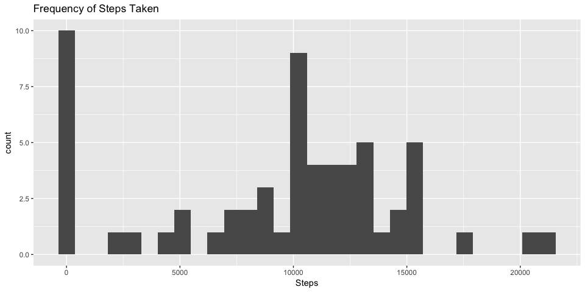
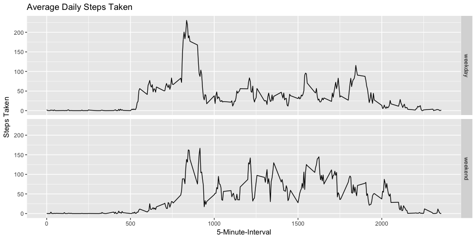

# Reproducing Data Peer Assignment 1
J.Chris Holt  
6/18/2017  

## Load Libraries

```r
knitr::opts_chunk$set(echo = TRUE)
library(dplyr)
library(lubridate)
library(ggplot2)
```

```
## Warning: package 'ggplot2' was built under R version 3.3.2
```

## Loading and preprocessing the data

```r
## Read in file and set POSIXct date
activity_raw <- read.csv(file = "activity.csv", sep = ",", stringsAsFactors = FALSE)
activity_raw$date <- ymd(activity_raw$date)
```

## What is mean total number of steps taken per day?

```r
# histogram of total steps taken
act_mm <- activity_raw %>% 
    group_by(date) %>% 
    summarize(steps_summed = sum(steps, na.rm=TRUE))

ggplot(data=act_mm, aes(steps_summed)) + geom_histogram() +
    ggtitle("Frequency of Steps Taken") + xlab("Steps")
```

```
## `stat_bin()` using `bins = 30`. Pick better value with `binwidth`.
```

<!-- -->

### The mean and median of total number of steps taken per day

```r
apd <- mean(act_mm$steps_summed, na.rm = TRUE)
mpd <- median(act_mm$steps_summed, na.rm = TRUE)
```
  
* Mean: 9354.2295082  
* Median: 10395

## What is the average daily activity pattern?


```r
avg_perint <- activity_raw %>%
    group_by(interval) %>%
    summarize(avg = mean(steps, na.rm=TRUE))

ggplot(data = avg_perint, aes(interval, avg)) +
    geom_line() + ggtitle("Average Daily Steps Taken") +
    xlab("5 Minute Interval") + ylab("Average Steps")
```

<!-- -->

### The busiest 5-minute-interval

```r
max5 <- avg_perint %>% filter(avg == max(avg_perint$avg)) %>% select(interval)
```
The most active 5-minute-interval across all the days in the dataset is 835.

### Imputing Missing Values
Missing steps values are imputed by using the average 5-minute-interval calculated in the prior step.

```r
act <- activity_raw
act$steps <- ifelse(is.na(act$steps) == TRUE, 
                    avg_perint$avg[avg_perint$interval %in% act$interval], 
                    act$steps)

act_mm2 <- act %>% 
    group_by(date) %>% 
    summarize(steps_summed = sum(steps, na.rm=TRUE))

# histogram of total steps taken
ggplot(data=act_mm2, aes(steps_summed)) + geom_histogram() +
    ggtitle("Frequency of Steps Taken with Imputed Values") +
    xlab("Steps")
```

<!-- -->

### The mean and median of total number of steps per day with imputed values

```r
apdi <- mean(act_mm2$steps_summed)
mpdi <- median(act_mm2$steps_summed)
```
The mean and median have changed after the missing steps values are imputed.
  
* Mean: 1.0766189\times 10^{4}  
* Median: 1.0766189\times 10^{4}

## Are there differences in activity patterns between weekdays and weekends?


```r
act_weekday <- act %>%
    mutate(day_type = as.factor(ifelse(weekdays(act$date) %in% c("Saturday","Sunday"), "weekend","weekday"))) %>%
    group_by(interval, day_type) %>%
    summarize(avg = mean(steps, na.rm=TRUE))

ggplot(data = act_weekday, aes(interval, avg)) +
    geom_line() + facet_grid(day_type~.) +
    ggtitle("Average Daily Steps Taken") +
    ylab("Steps Taken") +
    xlab("5-Minute-Interval")
```

<!-- -->
